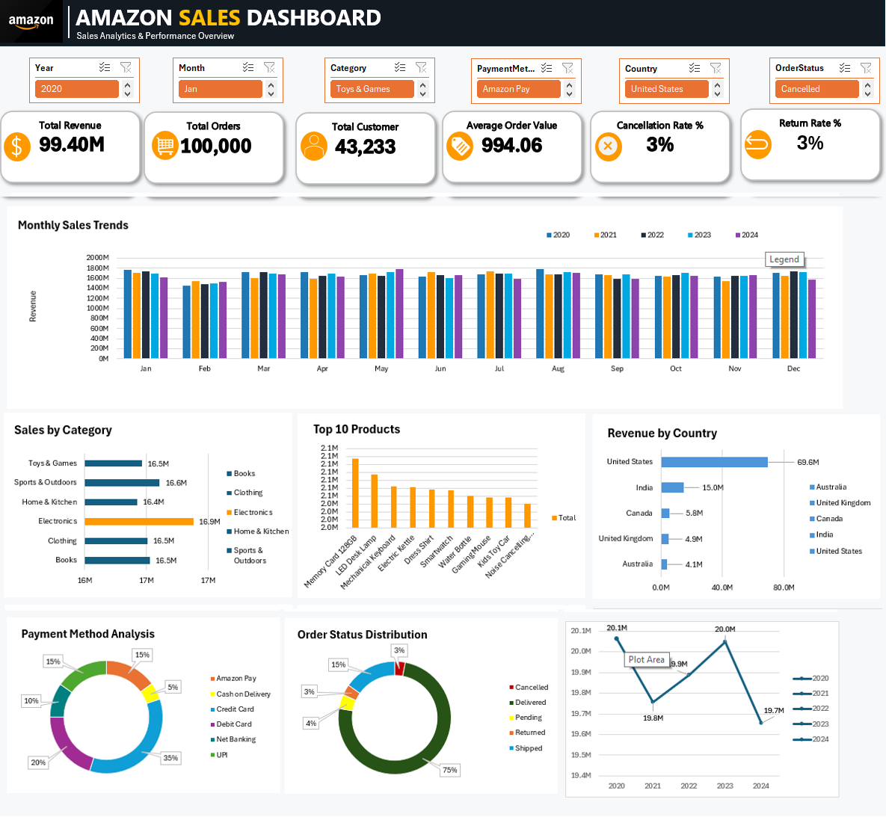

# 📊 Amazon Sales Dashboard in Excel

## Overview

This project demonstrates how to build an interactive **Amazon Sales Dashboard** in Microsoft Excel using raw sales data. The dashboard provides insights into sales performance, profit, orders, products, and customer behavior through Pivot Tables, Pivot Charts, Slicers, and KPI cards.

The objective of this project is to showcase Excel skills commonly used by Data Analysts for data cleaning, transformation, analysis, and dashboard development.

---
## 📂 Dataset

The dataset used in this project can be downloaded from Kaggle:

👉 **Amazon Sales Dataset:** https://www.kaggle.com/datasets/rohiteng/amazon-sales-dataset

**Source:** Kaggle

---

## Project Objectives

* Clean and prepare raw sales data
* Perform exploratory data analysis (EDA)
* Create Pivot Tables for business analysis
* Build interactive Pivot Charts
* Design a professional dashboard
* Enable dynamic filtering using Slicers
* Present key business insights

---

## Dataset

The dataset contains Amazon sales transactions with fields such as:

* OrderID	
OrderDate	
CustomerID	
CustomerName	
ProductID	
ProductName	
Category	
Brand	
Quantity	
UnitPrice	
Discount	
Tax	
ShippingCost	
TotalAmount	
PaymentMethod	
OrderStatus	
City	
State	
Country	
SellerID

---

## Tools Used

* Microsoft Excel
* Pivot Tables
* Pivot Charts
* Slicers
* Timeline Filter (optional)
* Conditional Formatting
* Excel Formulas
* Data Formatting

---

# Project Workflow

## Step 1: Import the Dataset

* Open Microsoft Excel.
* Load the raw Amazon Sales dataset.

---

## Step 2: Data Cleaning

Perform the following checks:

* Remove duplicate records
* Check for missing values
* Format dates correctly
* Format Sales and Profit as Currency
* Ensure Quantity is numeric
* Verify category names are consistent
* Remove unnecessary spaces using `TRIM()`
* Standardize text using `PROPER()` or `UPPER()` if needed

---

## Step 3: Explore the Dataset

Understand:

* Number of Orders
* Number of Customers
* Categories
* Regions
* Products
* Sales Distribution


---

## Step 4: Create Pivot Tables

Create Pivot Tables for:

### Sales by Category

Rows

* Category

Values

* Sum of Sales

---


### Profit by Category

Rows

* Category

Values

* Sum of Profit


---

### Monthly Sales Trend

Rows

* Month (from Order Date)

Values

* Sum of Sales

---

### Monthly Profit Trend

Rows

* Month

Values

* Sum of Profit

---

### Top 10 Products

Rows

* Product Name

Values

* Sum of Sales

Filter

* Top 10

---

## Step 5: Create KPI Metrics

Create summary cards for:

* Total Revenue
* Total Orders
* Total Customer
* Average Order Value(AOV)
* Cancellation Rate %
* Return Rate %


Example formulas:

Total Sales

```excel
=SUM(Table1[Sales])
```

Total Profit

```excel
=SUM(Table1[Profit])
```

Average Order Value

```excel
=Total Sales / Total Orders
```

Profit Margin

```excel
=Total Profit / Total Sales
```

---

## Step 6: Build Pivot Charts

Create charts such as:

* Clustered Column Chart
* Bar Chart
* Line Chart
* Pie Chart (optional)
* Donut Chart (optional)

Suggested visualizations:

* Monthly Sales Trend
* Sales by Category
* Sales by Region
* Top Products


---

## Step 7: Add Slicers

Insert slicers for:

* Region
* Segment
* Category
* Sub-Category
* Ship Mode

Connect all Pivot Tables to the slicers using **Report Connections**.

---

## Step 8: Dashboard Design

Create a separate worksheet named:

```
Dashboard
```

Arrange:

Top Section

* Project Title
* KPI Cards

Middle Section

* Sales Trend
* Profit Trend

Bottom Section

* Category Analysis
* Region Analysis
* Top Products

Side Panel

* Slicers

Use consistent colors, spacing, and alignment for a clean, professional layout.

---

## Step 9: Apply Formatting

* Remove unnecessary gridlines
* Use consistent fonts
* Add chart titles
* Format numbers as Currency
* Use theme colors
* Align objects evenly
* Highlight KPIs with contrasting colors

---

## Step 10: Validate the Dashboard

Verify that:

* All slicers filter every Pivot Table
* Charts update dynamically
* KPIs change with filters
* Data matches the source dataset
* No broken Pivot Tables

---

# Dashboard Features

* Interactive Filters
* Dynamic Charts
* KPI Summary Cards
* Monthly Sales Trend
* Regional Sales Analysis
* Category Performance
* Product Performance


---

# Business Insights

Example insights generated from the dashboard:

* Identify the highest revenue-generating product category.
* Determine the most profitable regions.
* Analyze monthly sales trends.
* Identify top-selling products.
* Compare sales and profit across categories.


---

# Skills Demonstrated

* Data Cleaning
* Data Preparation
* Excel Tables
* Pivot Tables
* Pivot Charts
* Dashboard Design
* Data Visualization
* KPI Reporting
* Business Analysis
* Interactive Reporting

---

# Dashboard Preview



---

# Learning Outcomes

By completing this project, I gained hands-on experience in:

* Preparing and cleaning business data.
* Building interactive Excel dashboards.
* Creating Pivot Tables and Pivot Charts.
* Designing executive-level KPI dashboards.
* Transforming raw data into actionable business insights.
* Presenting data in a professional and user-friendly format.

---